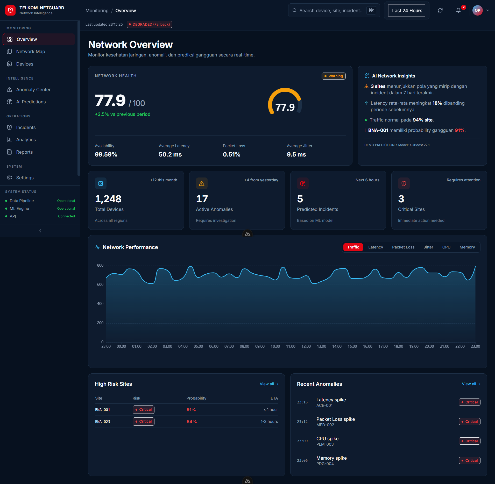
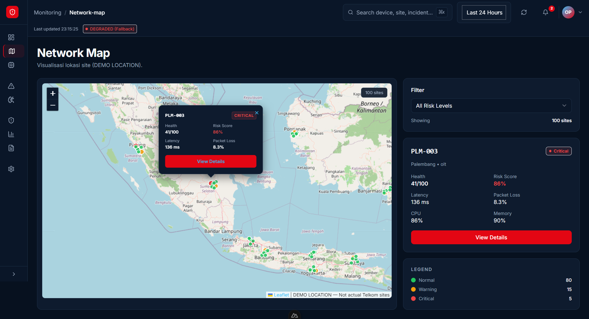
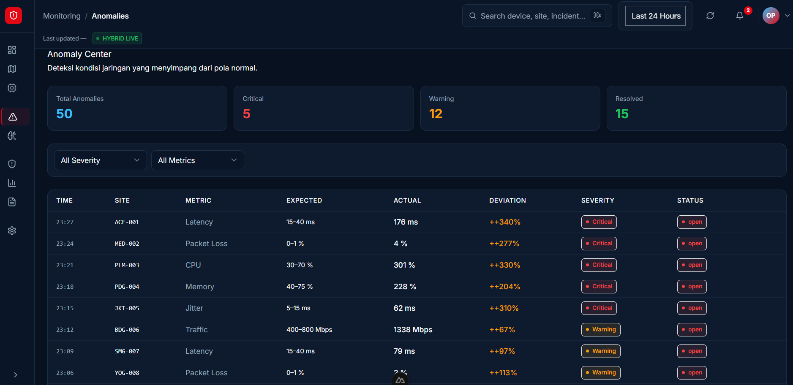

# 🛡️ TELKOM-NETGUARD

**AI-Powered Network Intelligence Dashboard** — Real-time network monitoring, anomaly detection, and predictive analytics integrated with live data from RIPE Atlas.

[](https://nuxt.com/)
[](https://vuejs.org/)
[](https://www.typescriptlang.org/)
[](https://tailwindcss.com/)
[](https://pinia.vuejs.org/)
[](LICENSE)

---


---

## Table of Contents

- [Features](#-features)
- [Tech Stack](#-tech-stack)
- [Architecture](#-architecture)
- [Prerequisites](#-prerequisites)
- [Installation](#-installation)
- [Configuration](#-configuration)
- [Development](#-development)
- [Project Structure](#-project-structure)
- [API Integration](#-api-integration)
- [Screenshots](#-screenshots)
- [Contributing](#-contributing)
- [License](#-license)

---

## Features

### 🔴 Real-Time Monitoring

- **Live Network Health** — Monitor latency, packet loss, jitter, and availability in real-time.
- **Hybrid Data Architecture** — Seamless integration with RIPE Atlas API with graceful mock fallback.
- **Smart Caching** — 5-minute server-side cache to prevent API rate limiting.
- **Data Honesty** — Dynamic UI badges showing real-time data source status (`LIVE` / `DEGRADED` / `DEMO`).

### AI-Powered Intelligence

- **Predictive Analytics** — ML-based failure prediction (XGBoost, LSTM models).
- **Anomaly Detection** — Automatic detection of latency spikes, packet loss, and CPU/memory anomalies.
- **Risk Assessment** — Probability-based risk scoring for network sites.

### Visualization

- **Interactive Charts** — Real-time performance metrics with 48-hour historical data (bucketed per 30 mins).
- **Network Map** — Geographic visualization of 100+ devices across 15 Indonesian regions using Leaflet.
- **Health Gauges** — Visual network health indicators (0-100 score).

### 🎯 Operations & Integrity

- **Incident Management** — Track, investigate, and resolve network incidents (25+ active records).
- **Device Monitoring** — 100+ devices with realistic naming conventions and regional mapping.
- **100% FK Integrity** — Strict data consistency between anomalies, incidents, and devices (zero phantom IDs).

### 🎨 User Experience

- **Dark Mode UI** — Professional NOC-grade interface built with Tailwind CSS.
- **Responsive Design** — Fully optimized for desktop, tablet, and mobile.
- **Graceful Degradation** — Dashboard remains fully functional and transparent even when upstream APIs fail.

---

## ️ Tech Stack

| Category             | Technology                                                  |
| -------------------- | ----------------------------------------------------------- |
| **Framework**        | [Nuxt 3](https://nuxt.com/) (Vue 3 + Vite)                  |
| **Language**         | [TypeScript](https://www.typescriptlang.org/) (Strict Mode) |
| **State Management** | [Pinia](https://pinia.vuejs.org/)                           |
| **UI Components**    | Custom Components + [Lucide Icons](https://lucide.dev/)     |
| **Styling**          | [Tailwind CSS](https://tailwindcss.com/)                    |
| **Charts**           | [ECharts](https://echarts.apache.org/) + Vue ECharts        |
| **Maps**             | [Leaflet](https://leafletjs.com/)                           |
| **Data Source**      | [RIPE Atlas API](https://atlas.ripe.net/)                   |
| **Date/Time**        | [Day.js](https://day.js.org/)                               |
| **HTTP Client**      | [ofetch](https://github.com/unjs/ofetch)                    |

---

## 🏗️ Architecture

### Hybrid Data Flow

```text
┌─────────────────────────────────────────────────────────────┐
│                    TELKOM-NETGUARD                          │
─────────────────────────────────────────────────────────────┤
│                                                             │
│  ┌──────────────────┐        ┌──────────────────────────┐  │
│  │  MOCK PROVIDER   │        │  RIPE ATLAS PROVIDER     │  │
│  │  (local)         │        │  (real network)          │  │
│  ├──────────────────┤        ├──────────────────────────┤  │
│  │ • Devices        │        │ • Latency (real)         │  │
│  │ • Sites          │        │ • Packet Loss (real)     │  │
│  │ • Predictions    │        │ • Probe status           │  │
│  │ • Incidents      │        │ • Real geo location      │  │
│  └──────────────────┘        └──────────────────────────┘  │
│           │                             │                  │
│           └──────────┬──────────────────┘                  │
│                      ▼                                     │
│           ┌──────────────────────┐                         │
│           │  HYBRID RESOLVER     │                         │
│           │  services/api.ts     │                         │
│           ──────────────────────┘                         │
│                      ▼                                     │
│           ┌──────────────────────┐                         │
│           │  DASHBOARD UI        │                         │
│           │  (badge per metric)  │                         │
│           └──────────────────────┘                         │
└─────────────────────────────────────────────────────────────┘
```
## 📸 Screenshots

### 📊 Dashboard Overview

*Network Health Score: 77.9/100 (Warning) | Real-time metrics: Latency 50.2ms, Packet Loss 0.51%, Jitter 9.5ms | 48-hour traffic chart with smooth curves | Badge shows "DEGRADED (Fallback)" when RIPE Atlas is unavailable*

### ️ Network Map

*100 devices across 15 Indonesian cities | Color-coded by risk level*

### 🚨 Incident Management

*25 incidents with full FK integrity | Status & severity tracking*

### ⚠️ Anomaly Center

*50 anomalies with varied deviations | Expected vs Actual values*


## 📊 Data Source States

| State | Badge | Description |
|-------|-------|-------------|
| **HYBRID LIVE** | 🟢 Green | Successfully fetching real data from RIPE Atlas. |
| **DEGRADED** | 🔴 Red | RIPE Atlas failed/timed out. Using cached mock fallback transparently. |
| **DEMO DATA** | 🟡 Yellow | Running in full mock mode (Development/Offline). |

---

## ⚙️ Configuration

### Environment Variables

| Variable | Default | Description |
|----------|---------|-------------|
| `NUXT_PUBLIC_USE_MOCK` | `true` | Toggle between mock and hybrid mode. |
| `NUXT_PUBLIC_RIPE_BASE` | `https://atlas.ripe.net/api/v2` | RIPE Atlas API endpoint. |
| `NUXT_PUBLIC_POLL_INTERVAL` | `300000` | Refresh interval in milliseconds (5 min). |
| `NUXT_PUBLIC_RIPE_API_KEY` | `""` | Optional API key for higher rate limits. |
